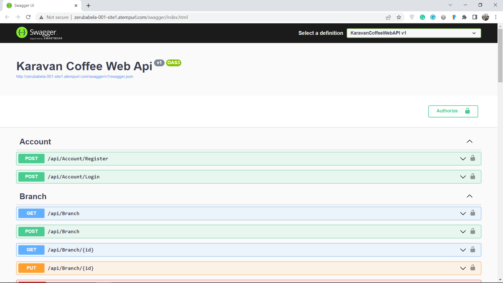

<div id="top"></div>

<!-- TABLE OF CONTENTS -->
<details>
  <summary>Table of Contents</summary>
  <ol>
    <li>
      <a href="#karavanapi">About Karavan Web API</a>
      <ul>
        <li><a href="#built-with">Built With</a></li>
      </ul>
    </li>
    <li>
      <a href="#getting-started">Getting Started</a>
      <ul>
        <li><a href="#prerequisites">Prerequisites</a></li>
        <li><a href="#installation">Installation</a></li>
      </ul>
    </li>
    <li><a href="#usage">Usage</a></li>
    <li><a href="#contributing">Contributing</a></li>
    <li><a href="#contact">Contact</a></li>
    <li><a href="#acknowledgements">Contact</a></li>
    <li><a href="#license">License</a></li>
  </ol>
</details>

<!-- ABOUT THE PROJECT -->
# KaravanAPI

This project is aimed to develop a Back-End REST Web API software which accepts client's requests and produce a response in a json format. We are using the MVC Pattern to develop the Karavan Web API. 

<p align="right">(<a href="#top">back to top</a>)</p>

## Preview 📸



### Built With

- Microsoft Visual Studio 2022 (Highly Recommended Since we will be using ASP.NET Core 7.0 and C# 10)
- Github
- Jest (test framework)

<p align="right">(<a href="#top">back to top</a>)</p>

## Live Demo

- Click [Here](http://zerubabela-001-site1.atempurl.com/swagger/index.html) to open the API on a free Hosting Site.

<!-- GETTING STARTED -->
## Getting Started

**Instructions on how to access my project locally:** 
- Open [this url](https://github.com/DebbyMiressa/KaravanAPI) in your web browser.
- Clone it to your local machine.
- Once the download is complete, you will be able to access the project locally . 

### Prerequisites

Once you clone the project and run it locally, you should see the NugGet Package installer automatically install packages. If not:
```sh
- In your top naviagetion tab in your visual studio, go to Tools -> NuGet Package Manager -> Manage NuGet Packages for Solutions.
- Then make sure you install the latest version for Microsoft packages such as EF Core, ASP.NET as well as mysql package (such as Pomelo).
```

### Installation


<p align="right">(<a href="#top">back to top</a>)</p>


<!-- USAGE EXAMPLES -->
## Usage

Run the project via Debug -> Start Debugging or just by clicking the play button. 
Make sure you have MySql Database Server in the Background if your server is localhost.

<p align="right">(<a href="#top">back to top</a>)</p>


<!-- CONTRIBUTING -->
## Contributing

Contributions 🤝 are what make the open source community such an amazing place to learn, inspire, and create. Any contributions you make are **greatly appreciated**.

If you have a suggestion that would make this better, please fork the repo and create a pull request. You can also simply open an issue with the tag "enhancement".
Don't forget to give the project a ⭐️! Thanks again!

1. Fork the Project
2. Create your Feature Branch (`git checkout -b feature/AmazingFeature`)
3. Commit your Changes (`git commit -m 'Add some AmazingFeature'`)
4. Push to the Branch (`git push origin feature/AmazingFeature`)
5. Open a Pull Request

<p align="right">(<a href="#top">back to top</a>)</p>


<!-- CONTACT -->
## Contact

👤 Debby Miressa

-  [@debby_miressa](https://github.com/DebbyMiressa)
-  [@debby_miressa](https://twitter.com/debby_miressa)
-  [@debby-miressa](https://www.linkedin.com/in/debby-miressa-0b85b6182)

👤 Zerubabel Shimelis

-  [](https://github.com/ZerubabelAster/)
-  [](https://twitter.com/)
-  [](https://www.linkedin.com/in/)


## Acknowledgments


## License

This project is [MIT](./MIT.md)  📝 licensed.
(Not yet ;))